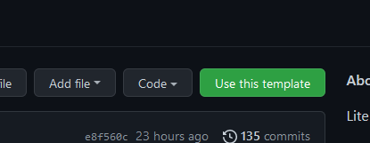
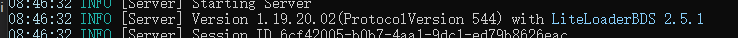

# 快速开始

## 前置条件

### 对于您

您需要了解C++的基础语法。
对于C++新手，请看[C++ tutorial](https://cplusplus.com/doc/tutorial/)。
您还需要至少成功运行LiteLoaderBDS一次，且略读了[LiteLoaderBDS文档](https://docs.litebds.com/zh-Hans/#/README)中除插件开发外的部分以理解LiteLoaderBDS如何运作。

### 对于您的计算机

目前，我们只支持在一小部分平台上构建插件。
如果你能协助我们利用所支持的平台，我们将真诚地感谢你。

所需的平台如下所示：

* Windows 10 64-bit / Windows 11

所需的软件如下所示：

* Minecraft基岩版专用服务器 [下载](https://www.minecraft.net/en-us/download/server/bedrock)
* Git [下载](https://git-scm.com/download/win)
* LiteLoaderBDS [下载](https://github.com/LiteLDev/LiteLoaderBDS/releases/latest)
* Microsoft Visual Studio 2022 (带Microsoft Visual C++) [下载](https://visualstudio.microsoft.com/vs/)

同时，我们建议您安装这些软件以获得更好的体验:

* CMake 3.21或更高版本 [下载](https://cmake.org/download/)
* Visual Studio Code的C/C++ Extension Pack
* GitHub Desktop [下载](https://desktop.github.com/)
* Minecraft基岩版
* Visual Studio Code [下载](https://code.visualstudio.com/download)

更重要的是，我们强烈建议您注册一个GitHub账户，这不仅是为了编写插件，也是为了优化你未来的编码经验。

## 创建您的第一个插件

现在您已经准备好了开发环境，现在是您从头开始创建第一个插件的时候了。

### 获取存储库的URL

* 如果您想在GitHub上托管你的代码，请访问[插件模板库](https://github.com/LiteLDev/PluginTemplate-cpp)，点击文本“Use this template”的按钮，然后填写表格，创建您的插件库。
然后复制你的仓库的URL。

    

* 如果您只想在本地开发，请复制`https://github.com/LiteLDev/PluginTemplate-cpp`到您的剪贴板上。

### 克隆版本库

* 打开PowerShell或命令提示符，在你想放仓库的地方，然后运行`git clone --recurse-submodules <repository URL>`。
注意，你应该用你在上一步复制的URL替换标签`<repository URL>`。
而且标志`--recurse-submodules`是必须的。

    

### 配置该插件

按照文件中的说明，修改`/src/Version.h`中的配置。
记住要删除以“static_assert”开头的那一行。
这里我们详细解释一下配置。

首先填写基本信息，插件的名称，简短的单行描述和包括你的名字。

```cpp
// The basic descriptions of your plugin
#define PLUGIN_NAME "My Plugin"
#define PLUGIN_INTRODUCTION "My Plugin is a plugin printing \"Hello, World!\" in the console."
#define PLUGIN_AUTHOR "Me"
```

然后设置插件的版本。
更多的参考信息请参考https://semver.org。
我们通过宏`PLUGIN_VERSION_STATUS`及其值`PLUGIN_VERSION_DEV`、`PLUGIN_VERSION_BETA`和`PLUGIN_VERSION_RELEASE`，提供三种状态预设：**dev**、**beta**和**release**。
一些编译器和链接行为随不同的预设而变化，但你不需要关心它。
如果该版本仍在开发中，请选择**dev**。
如果该版本是第一个要发布的次要版本，或者你对它的稳定性没有信心，选择**beta**。
如果该版本已经准备好供大家使用，没有疑问，请选择**release**。
你应该只把**release**版本视为正式发布的版本。

```cpp
// The version of your plugin. If you do not know how to set it, please refer
// to https://semver.org/ .
#define PLUGIN_VERSION_MAJOR 1
#define PLUGIN_VERSION_MINOR 0
#define PLUGIN_VERSION_REVISION 0
#define PLUGIN_VERSION_BUILD 0

// The stage of your plugin, which can be PLUGIN_VERSION_DEV, PLUGIN_VERSION_BETA
// and PLUGIN_VERSION_RELEASE
#define PLUGIN_VERSION_STATUS PLUGIN_VERSION_DEV
```

接下来，设置目标BDS协议版本。
一些开发者倾向于忽略这个配置，只是对它进行注释。
然而，我们不建议你这样做，因为一些API在不同的版本中是不同的，这可能会导致严重的不可预期的异常，甚至是文件损坏。

你应该已经安装了LiteLoaderBDS和BDS。
然后运行**bedrock_server_mod.exe**并找到这一行：



检查协议版本。
在上面的图片中，协议版本是544。

填写协议版本。

```cpp
#define TARGET_BDS_PROTOCOL_VERSION 545
```

### 构建该插件

* 如果你想在Visual Studio Code中用CMake构建（推荐），只需在Visual Studio Code中打开版本库目录，选择**Release**构建变量（或其他你喜欢的），然后点击**Build**。
然后插件将在`/build/Release/Plugin.dll`（或其他取决于你选择的构建变量）中生成。

* 如果你想直接用CMake进行构建，创建`/build/`目录。然后在`/build/`中打开PowerShell或命令提示符并运行`cmake ... && cmake --build . -j`。
然后插件将被生成为`/build/Plugin.dll`。

* 如果你想用Microsoft Visual Studio构建，在Microsoft Visual Studio中打开版本库目录，点击**构建**->**全部构建**或直接按`Ctrl`+`Shift`+`B`来构建。
然后该插件将被生成为`/out/x64-Debug/Plugin.dll`。

### 运行你的插件

将上一步生成的`Plugin.dll`复制到BDS目录下的`/plugin/`目录（如果没有找到，你应该先将LiteLoaderBDS应用到BDS。请参考[说明](https://docs.litebds.com/en/#/Usage)）.

在BDS目录下运行`/bedrock_server_mod.exe`。

### 观察插件的行为

现在你可以看到终端上显示的文字 "Hello, world!"。

恭喜你成功地创建了你的第一个插件!

## 进行进一步的修改

我打赌你不满足于仅仅是一个hello-world的技巧，这可以很容易地由任何C或C++程序实现，所以让我们做一些进一步的工作。

在进修者的脑海中存在一个问题：当有事情**发生**时，如何与Minecraft世界**互动**？

嗯，这个问题正是LiteLoaderBDS插件的意义所在。

为了详细说明，让我们把这个问题分成两部分，已经标记出来，并讨论每一部分的解决方案。

首先，与Minecraft世界的互动。
LiteLoaderBDS提供大量的API，直接对世界进行操作。
通过这些API，你可以获得一个实体或块，设置一个块，或运行一行命令。
然而，这些API的定义并没有被收集在一个头文件中，而是被分割成多个类。
你可以参考`/SDK/Header/GlobalServiceAPI.h`来查看包含这些API的类。
在本文中，我们将使用**Level**类，这是插件开发中最常见的类。

第二，一些事件发生时的观察者。
尽管BDS没有像GameTest中那样提供任何与事件相关的API，但我们为你勾画了一些常见的事件。
要查看所有的事件，你可以看一下`/SDK/Header/EventAPI.h`。
在这篇文章中，我们将使用**PlayerJoinEvent**。

按照下面的说明，你将创建一个插件，给每个玩家一个绿宝石，并在每个玩家加入游戏时在屏幕上显示欢迎横幅，以及在有人输入命令`latest`时显示最新加入的玩家的名字。
你准备好了吗？
让我们开始吧。

打开`/src/Plugin.cpp`，并按照下面的指示操作。

1. 包括必要的标题。

    ```cpp
    #include <string>

    #include <MC/CommandOrigin.hpp>
    #include <MC/CommandOutput.hpp>
    #include <MC/ItemStack.hpp>
    #include <MC/Level.hpp>
    #include <MC/Player.hpp>
    #include <MC/Types.hpp>

    #include <DynamicCommandAPI.h>
    #include <EventAPI.h>
    #include <GlobalServiceAPI.h>
    ```

    这么多头文件，对吗？
    为了更好地管理它们，我们建议你在某些变量或常量的类型被定义在头文件中时，才包括一个新的头文件，或者不包括头文件，你的插件就不能被建立。
    同时，你应该将这些头文件分组。
    一个可能的策略是将以`MC/`开头的头文件归为一组，STL头文件归为另一组，所有其他头文件归为最后一组。

2. 定义全局变量。

    ```cpp
    std::string latest_player_xuid;
    ```

    这个变量用于存储最新加入的玩家的XUID。

3. 听听这个活动。

    以下代码应放在`PluginInit()`函数中。

    ```cpp
    Event::PlayerJoinEvent::subscribe([](const Event::PlayerJoinEvent& event) {
    // Give the item to the player
    auto* item = ItemStack::create("minecraft:emerald", /* count = */ 1);
    event.mPlayer->giveItem(item);

    // Show banner on every player's screen
    auto all_player_list = Level::getAllPlayers();
    for (auto* player : all_player_list) {
        player->sendTitlePacket(
        event.mPlayer->getRealName() + "joined",
        TitleType::SetTitle,
        /* FadeInDuration = */ 1,
        /* RemainDuration = */ 3,
        /* FadeOutDuration = */ 1
        )
    }

    return true;
    });
    ```

    在这段代码中，我们用一个匿名的回调函数来订阅PlayerJoinEvent。

    在回调函数中，我们首先创建了一个物品堆栈，它代表了一个可以一次拿起的相同物品的集合，其标识符为`minecraft:emerald`，堆栈计数为1。
    然后我们直接从事件对象中提取玩家，并将物品堆栈交给玩家。

    然后我们尝试获取所有的玩家，遍历所有的玩家并将新加入的玩家的名字作为标题发送给他们。

    最后，我们返回true，表示该玩家可以加入服务器。
    否则，如果我们返回false，该玩家将被拒绝在服务器上。
    (如果你有足够的创造力和敏锐度，你可以想出这些功能可以用来创建一个自定义的白名单规则集)。

4. 登记命令

    下面的代码应该放在`PluginInit()`函数中。

    ```cpp
    DynamicCommand::setup(
    /* name = */ "latest",
    /* description = */ "Get latest player.",
    /* enums = */ {},
    /* params = */ {},
    /* overloads = */ {
        {},
    },
    /* callback = */ [](
        DynamicCommand const& command,
        CommandOrigin const& origin,
        CommandOutput& output,
        std::unordered_map<std::string, DynamicCommand::Result>& results
    ) {
        output.success(
        std::string("The latest player's name is ") +
        Global<Level>->getPlayer(latest_player_xuid)->getRealName()
        );
    }
    );
    ```

    如果你对这些参数的含义感兴趣，请参考DynamicCommand类。

    现在你可以建立该插件并在LiteLoaderBDS中测试它。

## 调试你的插件

在Microsoft Visual Studio中打开你的插件目录，项目将被自动配置。

将**解决方案资源管理器**改为CMake目标视图，右击项目，然后选择**添加调试配置**，创建`launch.vs.json`。

然后修改项目目标值为BDS可执行文件`bedrock_server_mod.exe`。

按F5来调试你的插件。

## 下一步是什么？

如果你仍然感到困惑，没有准备好自己创建一个插件，请看我们的[教程](90_tutorials_index.md)。

如果你对插件开发中更高级的技术感兴趣，请看我们的[指南](91_guides_index.md)。

如果你对某些API有疑问，或者你想知道你的插件能用这些API做什么，请[查找类](/en/classes.html)。

如果你渴望潜入BDS API的海洋，请参考[API参考](/api)。

如果你准备为这个文档做贡献，请到[我们的文档库](https://github.com/LiteLDev/docs-cpp)，提出问题或开启拉动请求。

我们真诚地祝愿您有一个美好的插件开发经验!